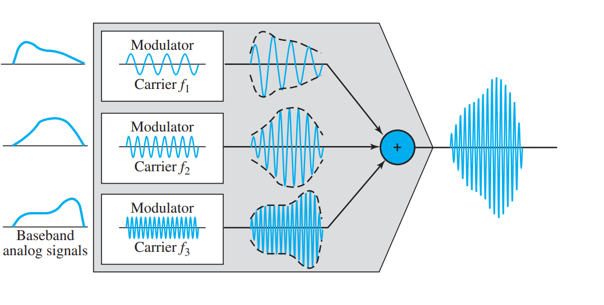
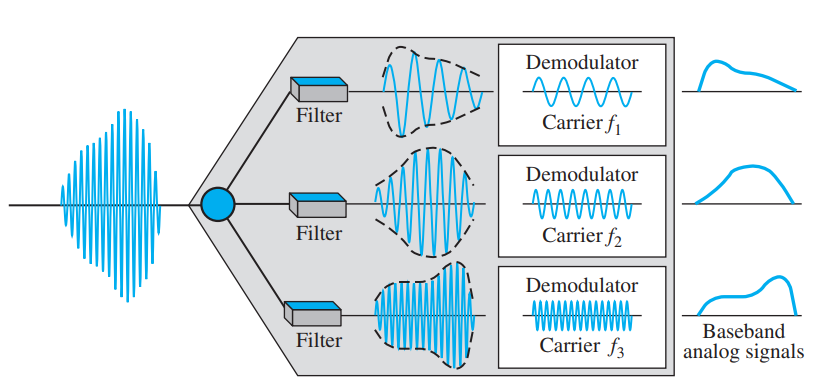

```{r knitr_init, echo=FALSE, error=FALSE, message=FALSE, warning=FALSE, cache=FALSE}
library(knitr)
library(highcharter)
library(rmdformats)
library(magrittr)
library(gsignal)
## Global options
options(max.print="75")
opts_chunk$set(echo=TRUE,
	             cache=TRUE,
               prompt=FALSE,
               tidy=TRUE,
               comment=NA,
               message=FALSE,
               warning=FALSE)
opts_knit$set(width=75)
```

# Multiplexación en el dominio de la frecuencia

<p style = "text-align: justify">
La multiplexación se puede clasificar en dos grandes tipos: multiplexación en el dominio de la frecuencia (FDM) y multiplexación en el dominio del tiempo (TDM). La multiplexación en el dominio del tiempo, asigna a cada usuario, dentro de un conjunto de ellos, con un intervalo de tiempo $\tau$. Durante ese lapso, el usuario puede utilizar el medio de transmisión para transmitir utilizando todo su ancho de banda $B_{\omega}$. La multiplexación en el dominio de la frecuencia, en cambio, divide el ancho de banda $B_{\omega}$, en canales $B^i_{\omega}$, de tal modo que utilizan ese espacio para transmitir durante cualquier espacio de tiempo. En esta práctica ahondaremos en la multiplexación en el dominio de la frecuencia usando `R`. La siguiente figura, muestra el diagrama a bloques de un módulo de multiplexación en el dominio de la frecuencia (FDM). Como se puede observar, la multiplexación en el dominio de la frecuencia se basa en bloques de modulación AM que trasladan los espectros en los canales que previamente fueron asignados y posteriormente realiza una suma con el objetivo de acomodar a cada usuario en el espectro asignado. Con esto, la suma representa la señal multiplexada en el dominio de la frecuencia.
</p>



<p style = "text-align: justify">
A continuación, obtendremos paso a paso una señal multiplexada, iniciando primeramente con los bloques de modulación AM. </p>

## Modulación AM

<p style = "text-align: justify">
Recordemos que la modulación AM puede clasificarse en varios tipos, como por ejemplo, la modulación DSB, DSBSC, SSB y VSB. No ahondaremos sobre cada una de ellas, sin embargo, se puede ahondar más en libros de sistemas de comunicaciones. En cambio, utilizaremos la modulación AM-DSB (de doble banda lateral con portadora suprimida) que se define como:
</p>

$$
s(t)_{\mbox{AM-DSB}} = f(t)\times \cos(2\pi f_c t),
$$
<p style = "text-align: justify">
donde, $f(t)$ representa la señal de información y la función coseno es la portadora con frecuencia $f_c$. La frecuencia $f_C$ es la que se encarga de controlar el punto hacía donde el espectro de la señal de información $f(t)$ se trasladará. Por ejemplo si $F(\omega)$ representa el espectro de $f(t)$, entonces:</p>

$$
\mathcal{F}\left\{f(t)\cos(\omega_c t)\right\} = \frac{1}{2}\left( F(\omega+\omega_c)+F(\omega-\omega_c)\right)2,
$$
<p style="text-alilgn: justify">donde $w_c = 2\pi f_C$. Verifiquemos ahora, la forma de la señal AM mediante la modulación de una señal de prueba representada por $f(t) = \cos(4\pi t)+1/3\sin(8\pi t)+1/3\cos(14\pi t)$.</p>


```{r AM}
x   <- seq(0,1, length=1000)
ft  <- 1.5*cos(4*pi*x)+ 0.3*sin(8*pi*x)+0.3*cos(14*pi*x)
ca  <- cos(2*pi*20*x)
am  <- ft*ca
highchart() %>% hc_add_series(cbind(x,ft), name="Información") %>% hc_title(text="\\(f(t) = 3/2\\cos(4\\pi t)+1/3\\sin(6\\pi t)+1/3\\cos(14\\pi t)\\)", useHTML=T) %>% hc_add_theme(hc_theme_db()) %>% hc_xAxis(title=list(text="Tiempo")) %>% hc_yAxis(title = list(text="Valores", useHTML=T), min=-1.3, max = 1.3, allowDecimal = T) %>% hc_chart(zoomType="xy") %>% hc_add_series(cbind(x,am), name="AM") %>% hc_add_series(cbind(x,ft), type= "line", dashStyle = "Dash", name="Envelope", color = "#ffb703") %>% hc_add_series(cbind(x,-ft), type= "line", dashStyle = "Dash", name="Envelope", color = "#ffb703")
```
<p style="text-alilgn: justify">Nótese que la señal portadora debe ser de una frecuencia mayor que la señal de información. La demodulación AM, se puede obtener multiplicando por la misma señal portadora y posteriormente haciendo pasar la señal por un filtro pasabajas. </p>

## Demodulación AM

<p style="text-alilgn: justify">
La demodulación AM, por tando es el mismo modulador AM y posteriormente pasando el resultado por un filtro. Por tanto, despues de realizar la modulación AM por segunda ocasión, ésta queda como:</p>

```{r dAM}
t   <- seq(0,1, length=1000)
inf  <- 1.5*cos(4*pi*t)+ 0.3*sin(8*pi*t)+0.3*cos(14*pi*t)
crr  <- cos(2*pi*20*t)
am  <- inf*crr
demAM <- am*crr
highchart() %>% hc_add_series(cbind(t,demAM), name="AM-DEM") %>% hc_add_series(cbind(t, inf), dashStyle = "Dash", name="Información", color = "#ffb703") %>%  hc_title(text="Modulación AM de una señal AM", useHTML=T) %>% hc_add_theme(hc_theme_db()) %>% hc_xAxis(title=list(text="Tiempo")) %>% hc_yAxis(title = list(text="Valores", useHTML=T), min=-1.8, max = 1.8, allowDecimal = T) %>% hc_chart(zoomType="xy")
```
<p style="text-alilgn: justify">Nótese que la señal resultante de esta segunda multiplicación es la señal de información junto a una señal de alta frecuencia que representa la señal portadora. Por lo tanto, el siguiente paso es eliminar la componente de alta frecuencia mediante un filtro pasabaja. La frecuencia de corte de éste filtro debe ser de por lo menos $7Hz$.`R` posee un paquete llamado `gsignal` que permite diseñar filtros mediante la función `butter`, que diseña un filtro tipo Butterworth. No se ahondará en la teoría y diseño de filtros, sin embargo, se necesita un filtro de por lo menos $7$Hz para recuperar la señal de información. Por lo tanto:</p>


```{r filtr}
library(highcharter)
library(gsignal)
x   <- seq(0,1, length=1000)
ft  <- 1.5*cos(4*pi*x)+ 0.3*sin(8*pi*x)+0.3*cos(14*pi*x)
ca  <- cos(2*pi*20*x)
am  <- ft*ca
demAM <- am*ca
fil   <- butter(4, 0.02)
recv  <- filter(fil, demAM)
highchart() %>% hc_add_series(cbind(x,ft), name="Original") %>% hc_add_series(cbind(x, recv), name="Recibida", color = "#ffb703") %>%  hc_title(text="Demodulación AM", useHTML=T) %>% hc_add_theme(hc_theme_538()) %>% hc_xAxis(title=list(text="Tiempo")) %>% hc_yAxis(title = list(text="Valores", useHTML=T), min=-1.8, max = 1.8, allowDecimal = T) %>% hc_chart(zoomType="xy")
```
## Demultiplexación FDM


En el receptor se tiene el siguiente diagrama. El cual consta de 


    
    
# Práctica:

Multiplexar las siguientes señales:

- $\cos(10\pi t)$
- $\cos(20\pi t)$
- $\frac{4}{\pi}\sin(6\pi t) + \frac{1}{3}\sin(18\pi t)$
